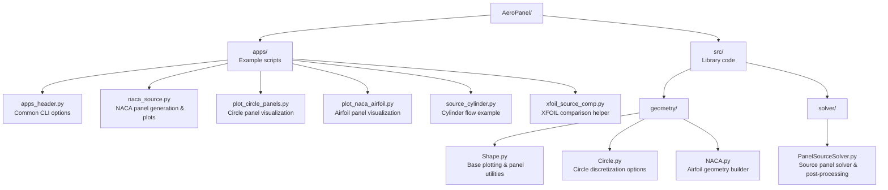
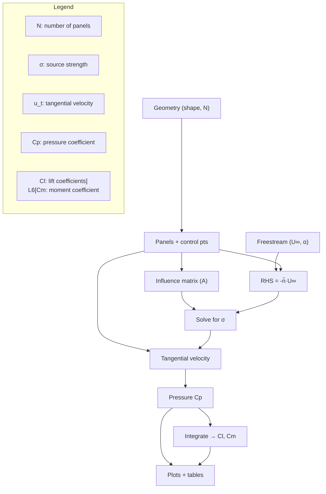

# AeroPanel - Pseudocode

This repository contains a lightweight, educational implementation of a **2D external flow solver** using the **constant-strength source panel method** (with an optional Kutta condition) and a handful of geometry utilities for shapes like circles and NACA airfoils. The `apps/` directory provides runnable examples for generating geometries, plotting panel layouts, and comparing pressure distributions. Core solver logic lives under `src/solver`, while reusable geometry definitions and plotting helpers sit in `src/geometry`.

### Repository Structure

---

---

## Inputs
- Body geometry (e.g., circle, NACA 0012)
- Number of panels `N`
- Freestream velocity `U∞` and angle of attack `α`\

---

## Step-by-Step Algorithm

### 1. Generate Panel Geometry
- Discretize surface into `N` panels with endpoints `(x_i, y_i)` (clockwise order)
- For each panel:
  - Compute panel length `Δs_i`
  - Compute panel unit tangent `t̂_i`
  - Compute outward unit normal `n̂_i`
  - Place control point at 3/4 of the panel

---

### 2. Compute Influence Coefficients
- For each control point `j`:
  - For each panel `i`:
    - Calculate the source panel influence `u^(S)(x_j; σ_i = 1)`
    - Project onto the normal:  
      `A_ji^(S) = n̂_j ⋅ u^(S)(x_j; σ_i = 1)`
- Construct the matrix `A` of size `N x N`

---

### 3. Assemble Right-Hand Side
- For each control point `j`:
  - Compute `RHS_j = - n̂_j ⋅ U∞`

---

### 4. Solve Linear System
- Solve `A * σ = RHS` for `σ_i` (panel source strengths)

---

### 5. Compute Tangential Velocity
- For each control point `j`:
  - Compute tangential velocity:
    `u_t,j = t̂_j ⋅ ( U∞ + ∑ u^(S)(x_j; σ_i) )`

---

### 6. Compute Pressure Coefficient
- For each panel `j`:
  - `Cp_j = 1 - (u_t,j / U∞)^2`

---

### 7. Integrate for Forces and Moments
- Use numerical integration (e.g., trapezoidal rule) to compute:
  - `Cl` – Lift coefficient
  - `Cm` – Moment coefficient (about quarter chord)

---

### 8. Plot and Output
- Plot:
  - Geometry with normals and control points
  - `Cp` distribution
- Output:
  - `σ_i`, `u_t`, `Cp`, `Cl`, `Cm`

---

## Test Cases
- **Case 1: Circular Cylinder**  
  Compare `Cp(θ)` with analytic solution:  
  `Cp(θ) = 1 - 4 sin²(θ)`

- **Case 2: NACA 0012**  
  Run for `α = 0°` and `5°`, analyze nonphysical trailing edge behavior due to lack of Kutta condition.

- **Case 3: XFOIL Comparison**  
  Compare results (Cp, Cl, Cm) with XFOIL output at same angle of attack.

---

## Notes
- Use **cosine spacing** for better clustering near leading/trailing edges
- Ensure **self-influence** is correctly computed
- Use **double precision** to handle matrix conditioning as `N` increases

---

## Data-Flow Diagram

